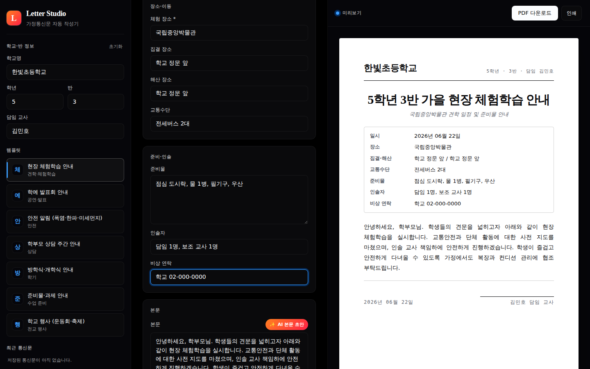

# 가정통신문 자동 작성기 · Letter Studio

> 1일 1바이브코딩 챌린지 **Day 41** · 100-vibecoding-topics #041
> 행정 카테고리 · 교사용 도구

행사·견학·안전공지 등 **7종 템플릿**의 빈 칸(날짜·장소·준비물)만 채우면 즉시 인쇄·PDF용 가정통신문이 완성됩니다. 학교/학년/반/담임 머리글은 한 번만 입력해 두면 모든 통신문 상단에 자동 표시됩니다.

🔗 **라이브 데모**: https://989-alt.github.io/project-41-gajeong-tongsinmun-jakseonggi/



## 핵심 기능

- **7종 가정통신문 템플릿**
  1. 현장 체험학습 안내
  2. 학예 발표회 안내
  3. 안전 알림 (폭염/한파/미세먼지)
  4. 학부모 상담 주간 안내
  5. 방학식·개학식 안내
  6. 준비물·과제 안내
  7. 학교 행사 (운동회·축제)
- **실시간 A4 미리보기** — 입력 즉시 우측 종이 미리보기 반영, 정형 인쇄 레이아웃.
- **PDF 다운로드** — `html2pdf.js` 로 A4 1장 저장. 라이브러리 차단 시 `window.print()` 폴백.
- **인쇄 직출력** — `@media print` CSS 가 편집 UI 를 숨기고 통신문만 종이에 출력.
- **학교 머리글 자동 채움** — localStorage 영속 저장, "정보 초기화" 1클릭.
- **최근 통신문 5개 캐시** — 사이드바에서 클릭 한 번에 복원.
- **AI 본문 초안 (선택)** — Gemini 2.5 Flash 공용 프록시 호출. 키 입력 UI 없음.
- **JSON 백업/복원** — 학교 머리글 + 최근 통신문을 1파일에.
- **다크/라이트 토글** — 편집 UI 만 토글, 통신문 종이는 항상 흰색.

## 의도적으로 배제한 것

- 학부모 전자 발송 (이메일·SMS·카카오톡) 어떤 형태도 **금지**.
- 학생 개인정보(이름·번호·연락처) 입력 칸 **없음**.
- Gemini API 키는 코드/스토리지/네트워크 헤더 어디에도 노출되지 않습니다 — **공용 프록시 호출, API 키 무포함**.

## 실행 방법

### 로컬

```bash
git clone https://github.com/989-alt/project-41-gajeong-tongsinmun-jakseonggi
cd project-41-gajeong-tongsinmun-jakseonggi
python3 -m http.server 5180 --bind 127.0.0.1
# → http://127.0.0.1:5180/
```

별도의 빌드 단계가 없습니다. `index.html` 을 브라우저에서 직접 열어도 동작합니다 (단 ES module 로딩을 위해 `file://` 보다 정적 서버 권장).

### 테스트

```bash
pip install playwright && python3 -m playwright install chromium
python3 ../1-day-1-code-project/webapp-testing/scripts/with_server.py \
  --server "python3 -m http.server 5181 --bind 127.0.0.1" --port 5181 \
  -- env APP_URL=http://127.0.0.1:5181/ python3 tests/e2e.py
```

## 기술 스택

- 단일 `index.html` + vanilla CSS + vanilla JS (ES modules)
- `html2pdf.js` (CDN) — PDF 생성
- Google Fonts: Inter / Noto Serif KR / Noto Sans KR
- Gemini 2.5 Flash via [`gemini-proxy`](https://github.com/989-alt/gemini-proxy)
- Playwright (Python) — e2e 테스트
- GitHub Pages — 배포

## 디자인 시스템

- **편집 UI**: [Resend](https://github.com/yourselfhosted/awesome-design-md/tree/main/design-md/resend) — 검정 캔버스, 흰 잉크, hairline border, 단일 액센트(파랑+오렌지).
- **인쇄될 통신문**: Notion-paper 영감 — 순백 종이, serif 헤드라인, 양끝맞춤 본문, 정형 메타 테이블.

## 적용한 skill

- `brainstorming` — MUST / SHOULD / MUST NOT 분할 기획
- `ui-ux-pro-max` — 색·타이포·접근성·인쇄 친화 디자인
- `senior-devops` (재정의: 코드 품질·구조 원칙)
- `webapp-testing` — Playwright e2e + `with_server.py` 통합

## 라이선스

MIT.
